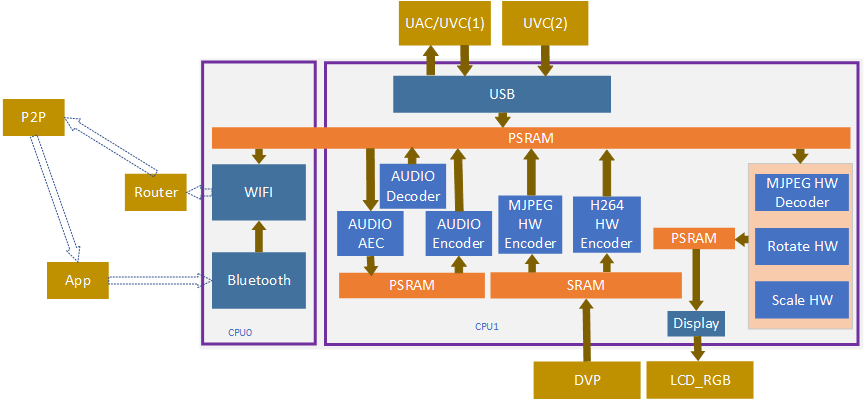
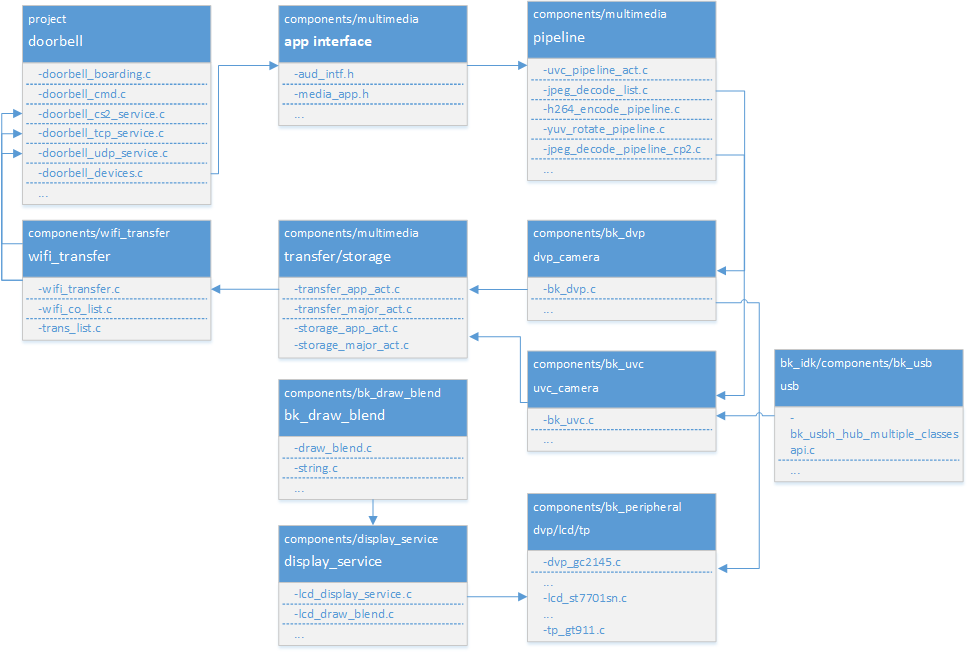
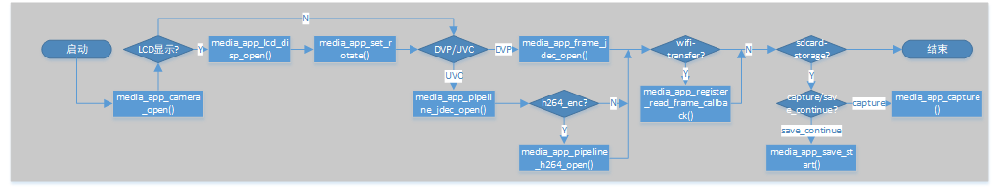
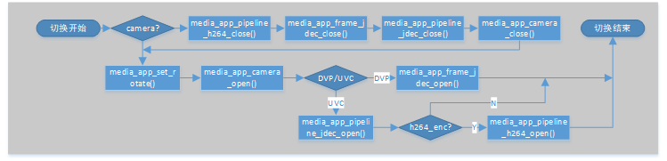
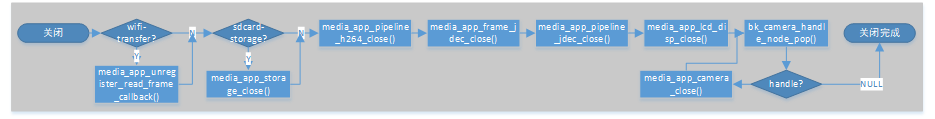
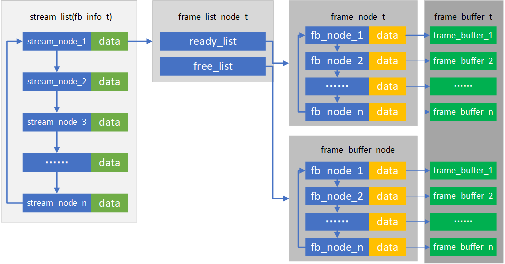

Doorbell
=================================

:link_to_translation:`zh_CN:[中文]`

1. Introduction
---------------------------------

This project is a demo of a USB camera door lock, supporting end-to-end (BK7258 device) to mobile app demonstrations. Support multi camera switch for door lock,
include 1 dvp and 2 uvc. The default use 16M psram.

1.1 Specifications
,,,,,,,,,,,,,,,,,,,,,,,,,,,,,,,,,

    * Hardware configuration:
        * Core board, **BK7258_QFN88_9X9_V3.2**
        * Display adapter board, **BK7258_LCD_interface_V3.0**
        * MIC small board, **BK_Module_Microphone_V1.1**
        * SPEAKER small board, **BK_Module_Speaker_V1.1**
        * PSRAM 8M/16M
    * Support, UVC
        * Reference peripherals, UVC resolution of **864 * 480**
    * Support, DVP
        * Reference peripherals, gc2145 resolution of **864 * 480**
    * Support, UAC
    * Support, TCP LAN image transmission
    * Support UDP LAN image transmission
    * Support, Shangyun, P2P image transfer
    * Support, LCD RGB/MCU I8080 display
        * Reference peripherals, **ST7701SN**, 480 * 854 RGB LCD
        * RGB565/RGB888
    * Support, hardware/software rotation
        * 0°, 90°, 180°, 270°
    * Support, onboard speaker
    * Support, Micro
    * Support, MJPEG hardware decoding
        * YUV422
    * Support, MJPEG software decoding
        * YUV420
    * Support, H264 hardware decoding
    * Support, OSD display
        * ARGB888[PNG]
        * Custom Font

.. warning::
    Please use reference peripherals to familiarize and learn about demo projects.
    If the specifications of the peripherals are different, the code may need to be reconfigured.

1.2 Path

    <bk_avdk source code path>/projects/media/doorbell

2. Framework diagram
---------------------------------

2.1 Software Module Architecture Diagram
,,,,,,,,,,,,,,,,,,,,,,,,,,,,,,,,,,,,,,,,,,,,,,

    As shown in the following figure, BK7258 has multiple CPUs:
        * CPU0, running WIFI/BLE as a low-power CPU.
        * CPU1, running multimedia and serves as a high-performance multimedia CPU.

    Figure 1. software module architecture

..

    * In the UVC scheme, we adopt a pipeline approach to improve overall performance.
    * The images output by UVC cameras can be divided into two types: YUV420 MJPEG and YUV422 MJPEG.
        * The software will automatically recognize and use a hardware decoder to decode YUV422 MJPEG. YUV420 MJPEG uses CPU1 and CPU2 for software decoding.
        * When decoding hardware, the image resolution needs to be a multiple of 32 for wide resolution and a multiple of 16 for high resolution.
        * YUV pixel arrangement is divided into planar format, packed format, and semi planar format. Hardware encoded data, in packet format when required.
    * MJPEG HW Decoder, in pipeline mode, due to the encoding data of H264, it needs to be decoded based on MJPEG before encoding. Therefore, both local display and image transmission will use this hardware module.
        * When closing, it is important to note that both the display and image transfer are closed before closing this module. The default demo already includes this logic.
    * MJPEG SW Decoder, two decoders will not work simultaneously at the same time.
        * Once the image is confirmed to be YUV420 or YUV422, it is decided whether to use software decoding or hardware decoding.
        * When work camera switch, one camera may output JPEG(YUV422) and another may output JPEG(YUV420), the system can recognize format and readapt decode method, customer not need do other work.
    * Rota HW and Rota SW will only use one type of rotating module at the same time.
        * Rota HW, supports RGB 565 image output, supports 0°, 90°, 270°.
        * Rota SW supports 0°, 90°, 180°, and 270°.
        * If you need to use RGB888 output or support 180°, and meet one of the conditions, you need to switch to software decoding.
        * How to make decisions on Rota HW and Rota SW currently is determined by the SDK software. Users only need to input the rotation angle and output image format parameters into the corresponding interface when opening the LCD.

2.2 Code Module Relationship Diagram
,,,,,,,,,,,,,,,,,,,,,,,,,,,,,,,,,,,,,,,,,,,

    As shown in the following figure, multimedia interfaces are defined in **media_app.h** and **aud_intf.h**.

    Figure 2. module relationship diagram

3. Configuration
---------------------------------

3.1 Bluetooth and Multimedia Memory Reuse
,,,,,,,,,,,,,,,,,,,,,,,,,,,,,,,,,,,,,,,,,,,,,,,

    In order to further save memory, in the default project, the multimedia memory encoding and decoding memory and Bluetooth memory are multiplexed, mainly using the following two macros.
    If you want to use two modules in parallel, you can close them yourself. Please confirm if the overall memory is sufficient before closing.

    ========================================  ===============  ===============  ===============
    Kconfig                                     CPU             Format            Value    
    ========================================  ===============  ===============  ===============
    CONFIG_BT_REUSE_MEDIA_MEMORY                CPU0 && CPU1    bool                y    
    CONFIG_BT_REUSE_MEDIA_MEM_SIZE              CPU0 && CPU1    hex               0x1B000
    ========================================  ===============  ===============  ===============

    * In order to solve memory reuse conflicts during actual use, it is necessary to check the status of Bluetooth and disable or uninstall Bluetooth before using the multimedia module.
    * If the multimedia modules have already been turned off and you want to use them again, you need to reinitialize Bluetooth. Please refer to the following code.
    * The range of values is based on the maximum memory required by the Bluetooth hardware module and the maximum memory required for multimedia hardware encoding, with one value being the maximum.
    * The hardware memory requirements for general Bluetooth are relatively small [actual statistics need to be calculated based on the compiled map program]. Because it is generally configured according to the maximum memory capacity of multimedia hardware.

3.1.1 Uninstalling Bluetooth
.................................

::

    #ifdef CONFIG_BT_REUSE_MEDIA_MEMORY
    #if CONFIG_BLUETOOTH
        bk_bluetooth_deinit();
    #endif
    #endif

3.1.2 Initialize Bluetooth
.................................

::

    bk_bluetooth_init();

3.2 Hardware Decoding Memory Configuration Instructions
,,,,,,,,,,,,,,,,,,,,,,,,,,,,,,,,,,,,,,,,,,,,,,,,,,,,,,,,,,,,

    A hardware accelerator requires a portion of memory, which is optimized based on the actual resolution.
    The default configuration parameters are LCD with a 480 * 854 vertical screen and Camera with an 864 * 480 MJPEG image.

::

    //The recommended output resolution and width for Camera are multiples of 32. When the default configuration of the screen and camera is small, memory can be optimized by modifying the configuration macro.
    #define IMAGE_MAX_WIDTH (864)
    #define IMAGE_MAX_HEIGHT (480)

    //When starting the scaling module, it is necessary to pay attention to these two sets of parameters. The default recommendation is that the width should be slightly larger than the screen.
    #define DISPLAY_MAX_WIDTH (864)
    #define DISPLAY_MAX_HEIGHT (480)

    typedef struct {
    #if SUPPORTED_IMAGE_MAX_720P
        uint8_t decoder[DECODE_MAX_PIPELINE_LINE_SIZE * 2];
        uint8_t scale[SCALE_MAX_PIPELINE_LINE_SIZE * 2];
        uint8_t rotate[ROTATE_MAX_PIPELINE_LINE_SIZE * 2];
    #else
        uint8_t decoder[DECODE_MAX_PIPELINE_LINE_SIZE * 2];
        uint8_t rotate[ROTATE_MAX_PIPELINE_LINE_SIZE * 2];
    #endif

    } mux_sram_buffer_t;

    * If rotation is not required, the memory of the rotating part can be saved.
    * Attention should be paid to the resolution of scaling. The scaled resolution, width, and height must all be multiples of 8.

.. caution::
    When the VNet BT-REUSEUMEDIA.MMORY macro is opened, this portion of memory will be reused with Bluetooth hardware memory.

4. Demonstration explanation
---------------------------------

    Please visit `APP Usage Document <https://docs.bekencorp.com/arminodoc/bk_app/app/zh_CN/v2.0.1/app_usage/app_usage_guide/index.html#debug>`__.

.. hint::
    If you do not have cloud account permissions, you can use debug mode to set the local area network TCP/UDP/CS2 image transmission method.

5. Code explanation
---------------------------------

5.1 UVC Camera
,,,,,,,,,,,,,,,,,,,,,,,,,,,,,,,,,

    Supported peripherals, please refer to `Support Peripherals <../../../support_peripherals/index.html>`_

5.1.1 Turn on UVC
.................................

5.1.1.1 Application Code
*********************************

::

    //Path      : projects/media/doorbell/main/src/doorbell_devices.c
    //Loaction  :  CPU0

    int doorbell_camera_turn_on(camera_parameters_t *parameters)
    {
        ...

        //turn on camera
        ret = media_app_camera_open(&db_device_info->video_handle, &device);

        //set rotate angle
        //attentions:
        //    1.while MJPEG be YUV422 MJPEG, only rotate on local lcd, the h264 stream not rotate.
        //    2.while MJPEG be UV420 MJPEG, rotate do the same time with jpeg decode, 
        media_app_set_rotate(rot_angle);

        //enable h264 encode pipeline
        ret = media_app_h264_pipeline_open();

        if (device.type == UVC_CAMERA)
        {
            // uvc output jpeg frame and open jpeg decode, decode by 16 lines outout yuv format.
            media_app_pipeline_jdec_open();
        }
        else if (device.type == DVP_CAMERA)
        {
            // dvp output yuv format data, enable yuv deal task
            media_app_frame_jdec_open(NULL);
        }

        ...
    }

5.1.1.2 Interface Code
*********************************

::

    //Path      :  components/multimedia/app/media_app.c
    //Loaction  :  CPU0

    bk_err_t media_app_camera_open(camera_handle_t *handle, media_camera_device_t *device)
    {
        ...

        //Uninstall Bluetooth
        #ifdef CONFIG_BT_REUSE_MEDIA_MEMORY
        #if CONFIG_BLUETOOTH
            bk_bluetooth_deinit();
        #endif
        #endif

        //Vote to activate CPU1. The purpose of voting is to ensure that CPU1 can be automatically turned off when not in use, in order to achieve the goal of low power consumption.
        bk_pm_module_vote_boot_cp1_ctrl(PM_BOOT_CP1_MODULE_NAME_VIDP_JPEG_EN, PM_POWER_MODULE_STATE_ON);

        //Notify CPU1 to turn on the UVC camera.
        media_device_t media_device = {0};
        media_device.param1 = (uint32_t)handle;
        media_device.param2 = (uint32_t)device;
        //notify cpu1 open camera
        ret = media_send_msg_sync(EVENT_CAM_UVC_OPEN_IND, (uint32_t)media_device);

        ...
    }

    typedef struct {
        camera_type_t type; // camera type
        uint16_t port;      // camera port index(uvc:[1,3], dvp:0)
        uint16_t format;    // camera output image format, reference image_format_t
        uint16_t width;     // camera output image width
        uint16_t height;    // camera output image height
        uint32_t fps;       // camera output image fps
        media_rotate_t rotate;// reserve
    } media_camera_device_t;

5.1.2 Obtain an image
.................................

5.1.2.1 Enable interface
*********************************

::

    //Path      : components/multimedia/app/media_app.c
    //Loaction  :  CPU0

    bk_err_t media_app_register_read_frame_callback(image_format_t fmt, frame_cb_t cb)
    {
        ...

        //cb: register image process callback, will return a frame buffer in callback function
        //fmt: the image format you want to read

        ...
    }

5.1.2.2 Disable interface
*********************************

::

    //Path      : components/multimedia/app/media_app.c
    //Loaction  :  CPU0
    bk_err_t media_app_unregister_read_frame_callback(void)
    {
        ...

        //called this function, will stop read frame, and the callback that be register not been called again

        ...
    }

.. attention::
    Here introduces how to read images, through the above interface, users can get the image, but in the callback function, do not handle it too long, it is recommended to copy the image data to the customer thread for processing in the callback function, otherwise, the task of reading images will be stuck, leading to frame loss.

5.1.3 Turn off UVC
.................................

5.1.3.1 Application Code
*********************************
::

    //Path      :  projects/media/doorbell/main/src/doorbell_devices.c
    //Loaction  :  CPU0

    int doorbell_camera_turn_off(void)
    {
        ...

        //Disable H264 encoding
        media_app_h264_pipeline_close();

        //close jpeg decode pipeline function(maybe not open before)
        media_app_pipeline_jdec_close();
        //close yuv data process task(maybe not open before)
        media_app_frame_jdec_close();

        //close all camera have been opened
        do {
            //get current camera handle
            db_device_info->video_handle = bk_camera_handle_node_pop();
            if (db_device_info->video_handle)
            {
                LOGI("%s, %d, %p\n", __func__, __LINE__, db_device_info->video_handle);
                media_app_camera_close(&db_device_info->video_handle);
            }
            else
            {
                break;
            }
        } while (1);

        ...
    }

5.1.3.2 Interface Code
*********************************

::

    //Path      :  components/multimedia/app/media_app.c
    //Loaction  :  CPU0

    bk_err_t media_app_camera_close(camera_handle_t *handle)
    {
        ...

        //Turn off UVC camera by handle
        ret = media_send_msg_sync(EVENT_CAM_UVC_CLOSE_IND, (uint32_t)handle);

        //Vote to allow CPU1 to be turned off. The purpose of voting is to ensure that CPU1 can be automatically turned off when not in use, in order to achieve the goal of low power consumption.
        bk_pm_module_vote_boot_cp1_ctrl(PM_BOOT_CP1_MODULE_NAME_VIDP_JPEG_EN, PM_POWER_MODULE_STATE_OFF);

        ...
    }

    bk_err_t media_app_pipeline_jdec_open(void)
    {
        ...

        //vote to enable cpu1
        bk_pm_module_vote_boot_cp1_ctrl(PM_BOOT_CP1_MODULE_NAME_VIDP_JPEG_DE, PM_POWER_MODULE_STATE_ON);

        //set jpeg decode yuv data need rotate or not
        ret = media_send_msg_sync(EVENT_PIPELINE_SET_ROTATE_IND, jpeg_decode_pipeline_param.rotate);

        //enable jpeg decode pipeline function
        ret = media_send_msg_sync(EVENT_PIPELINE_LCD_JDEC_OPEN_IND, 0);

        ...
    }

.. warning::
        * All operations involving multimedia require attention to the requirement of low power consumption. To turn on the device, it must be turned off, otherwise the entire system cannot enter low-power mode.
        * The operation involving CPU1 voting, opening and closing, must appear in pairs, otherwise there will be a problem of CPU1 being unable to close and increasing power consumption.
        * You can refer to the chapter on low power consumption

5.2 LCD Display
,,,,,,,,,,,,,,,,,,,,,,,,,,,,,,,,,

    Supported peripherals, please refer to `Support Peripherals <../../../support_peripherals/index.html>`_

5.2.1 Open LCD
.................................

5.2.1.1 Application Code
*********************************

::

    //Path      : projects/media/doorbell/main/src/doorbell_devices.c
    //Loaction  :  CPU0

    int doorbell_display_turn_on(uint16_t id, uint16_t rotate, uint16_t fmt)
    {
        ...

        //Set the pixel format for display
        if (fmt == 0)
        {
            media_app_lcd_fmt(PIXEL_FMT_RGB565_LE);
        }
        else if (fmt == 1)
        {
            media_app_lcd_fmt(PIXEL_FMT_RGB888);
        }

        //Set the rotation angle.
        switch (rotate)
        {
            case 90:
                rot_angle = ROTATE_90;
                break;
            case 180:
                rot_angle = ROTATE_180;
                break;
            case 270:
                rot_angle = ROTATE_270;
                break;
            case 0:
            default:
                rot_angle = ROTATE_NONE;
                break;
        }

        media_app_set_rotate(rot_angle);

        //Open local LCD display
       media_app_lcd_disp_open(&lcd_open);

        ...
    }

5.2.1.2 Interface Code
*********************************

::

    //Path      :  components/multimedia/app/media_app.c
    //Loaction  :  CPU0

    bk_err_t media_app_lcd_pipeline_open(void *lcd_open)
    {
        ...

        //
        ret = media_app_lcd_pipeline_disp_open(config);

        //
        ret = media_app_lcd_pipeline_jdec_open();

        ...
    }

    bk_err_t media_app_lcd_disp_open(void *config)
    {
        ...

        //Vote to activate CPU1. The purpose of voting is to ensure that CPU1 can be automatically turned off when not in use, in order to achieve the goal of low power consumption.
        bk_pm_module_vote_boot_cp1_ctrl(PM_BOOT_CP1_MODULE_NAME_VIDP_LCD, PM_POWER_MODULE_STATE_ON);

        //Notify CPU1 to turn on the LCD
        ret = media_send_msg_sync(EVENT_PIPELINE_LCD_DISP_OPEN_IND, (uint32_t)config);

        ...
    }

5.2.2 Turn off LCD
.................................

5.2.2.1 Application Code
*********************************

::

    //Path      : projects/media/doorbell/main/src/doorbell_devices.c
    //Loaction  :  CPU0

    int doorbell_display_turn_off(void)
    {
        ...

        //Turn off local LCD display
        media_app_lcd_pipeline_close();

        ...
    }

5.2.2.2 Interface Code
*********************************

::

    //Path      : components/multimedia/app/media_app.c
    //Loaction  :  CPU0

    bk_err_t media_app_lcd_disp_close(void)
    {
        ...

        //Turn off the display LCD
        ret = media_send_msg_sync(EVENT_PIPELINE_LCD_DISP_CLOSE_IND, 0);

        //vote to close cpu1
        bk_pm_module_vote_boot_cp1_ctrl(PM_BOOT_CP1_MODULE_NAME_VIDP_LCD, PM_POWER_MODULE_STATE_OFF)

        ...
    }

5.2.3 OSD Display
.................................

5.3 Audio
,,,,,,,,,,,,,,,,,,,,,,,,,,,,,,,,,

5.3.1 Open UAC, onboard MIC/SPEAKER
......................................

::

    //Path      :  projects/media/doorbell/main/src/doorbell_devices.c
    //Loaction  :  CPU0

    int doorbell_audio_turn_on(audio_parameters_t *parameters)
    {
        ...

        //Enable AEC
        if (parameters->aec == 1)
        {
            aud_voc_setup.aec_enable = true;
        }
        else
        {
            aud_voc_setup.aec_enable = false;
        }

        //Set SPEAKER single ended mode
        ud_voc_setup.spk_mode = AUD_DAC_WORK_MODE_SIGNAL_END;

        //Turn on UAC
        if (parameters->uac == 1)
        {
            aud_voc_setup.mic_type = AUD_INTF_MIC_TYPE_UAC;
            aud_voc_setup.spk_type = AUD_INTF_SPK_TYPE_UAC;
        }
        else //Activate onboard MIC and SPEAKER
        {
            aud_voc_setup.mic_type = AUD_INTF_MIC_TYPE_BOARD;
            aud_voc_setup.spk_type = AUD_INTF_SPK_TYPE_BOARD;
        }

        if (aud_voc_setup.mic_type == AUD_INTF_MIC_TYPE_BOARD && aud_voc_setup.spk_type == AUD_INTF_SPK_TYPE_BOARD) {
            aud_voc_setup.data_type = parameters->rmt_recoder_fmt - 1;
        }

        //Set sampling rate
        switch (parameters->rmt_recorder_sample_rate)
        {
            case DB_SAMPLE_RARE_8K:
                aud_voc_setup.samp_rate = 8000;
            break;

            case DB_SAMPLE_RARE_16K:
                aud_voc_setup.samp_rate = 16000;
            break;

            default:
                aud_voc_setup.samp_rate = 8000;
            break;
        }

        //Register MIC data callback
        aud_intf_drv_setup.aud_intf_tx_mic_data = doorbell_udp_voice_send_callback;

        ...
    }

5.3.2 Obtaining uplink MIC data
.................................

::

    //Path      :  projects/media/doorbell/main/src/doorbell_devices.c
    //Loaction  :  CPU0

    //Register MIC callback
    aud_intf_drv_setup.aud_intf_tx_mic_data = doorbell_udp_voice_send_callback;
    ret = bk_aud_intf_drv_init(&aud_intf_drv_setup);

    int doorbell_udp_voice_send_callback(unsigned char *data, unsigned int len)
    {
        ...

        //The usual callback is to transmit in the direction of WIFI.
        return db_device_info->audio_transfer_cb->send(buffer, len, &retry_cnt);
    }

5.3.3 Play downstream SPEAKER data
........................................

::

    //Path      :  projects/media/doorbell/main/src/doorbell_devices.c
    //Loaction  :  CPU0

    void doorbell_audio_data_callback(uint8_t *data, uint32_t length)
    {
        ...

        //Send data to SPEAKER
        ret = bk_aud_intf_write_spk_data(data, length);

        ...
    }

5.3.4 AEC/Noise Reduction Treatment
.........................................

    Please refer to `AEC Debug <../../../audio_algorithms/aec/index.html>`_

5.3.7 Turn off UAC, onboard MIC/SPEAKER
...........................................

::

    //Path      :  projects/media/doorbell/main/src/doorbell_devices.c
    //Loaction  :  CPU0

    int doorbell_audio_turn_off(void)
    {
        ...

        bk_aud_intf_voc_stop();
        bk_aud_intf_voc_deinit();
        /* deinit aud_tras task */
        aud_work_mode = AUD_INTF_WORK_MODE_NULL;
        bk_aud_intf_set_mode(aud_work_mode);
        bk_aud_intf_drv_deinit();

        ...
    }

5.4 H264 Encoding and Decoding
,,,,,,,,,,,,,,,,,,,,,,,,,,,,,,,,,

    Please refer to the `H264 encoding <../../../video_codec/H264_encoding/index.html>`_

5.5 WIFI transmission
,,,,,,,,,,,,,,,,,,,,,,,,,,,,,,,,,

5.5.1 Setting up WIFI network data transmission callback
..............................................................

::

    //Path      :  projects/media/doorbell/main/src/doorbell_udp_service.c
    //Loaction  :  CPU0

    bk_err_t doorbell_udp_service_init(void)
    {
        ...

        //Here, we have set up callbacks for image and audio data to WIFI
        doorbell_devices_set_camera_transfer_callback(&doorbell_udp_img_channel);
        doorbell_devices_set_audio_transfer_callback(&doorbell_udp_aud_channel);

        ...
    }

    typedef struct {
        //The callback for the final data transmission
        media_transfer_send_cb send;

        //Packaging of Head and Payload before Data Transmission
        media_transfer_prepare_cb prepare;

        //Optimize packet loss handling for latency optimization
        media_transfer_drop_check_cb drop_check;

        //Obtain the TX data buffer that needs to be filled
        media_transfer_get_tx_buf_cb get_tx_buf;

        //Get the size of the TX buffer to be filled
        media_transfer_get_tx_size_cb get_tx_size;

        //Set the data format of the image
        pixel_format_t fmt;
    } media_transfer_cb_t;

5.5.1 Obtaining H264 image data
.................................

::

    //Path      :  components/wifi_transfer/src/wifi_transfer.c
    //Loaction  :  CPU0

    bk_err_t bk_wifi_transfer_frame_open(const media_transfer_cb_t *cb, uint16_t img_format)
    {
        ...

        //Improve the performance of network image transmission
        bk_wifi_set_wifi_media_mode(true);
        bk_wifi_set_video_quality(WIFI_VIDEO_QUALITY_SD);

        ...

        //Register H264 image data and obtain callback(if need h264 fmt=IMAGE_H264)
        ret = media_app_register_read_frame_callback(img_format, wifi_transfer_read_frame_callback);

        ...
    }

5.5.2 Open Image Data Image Transfer
.......................................

::

    //Path      :  projects/media/doorbell/main/src/doorbell_devices.c
    //Loaction  :  CPU0

    int doorbell_video_transfer_turn_on(void)
    {
        ...

        //Open image transfer
        if (db_device_info->camera_transfer_cb)
        {
            if (db_device_info->h264_transfer)
            {
                ret = bk_wifi_transfer_frame_open(db_device_info->camera_transfer_cb, IMAGE_H264);
            }
            else
            {
                ret = bk_wifi_transfer_frame_open(db_device_info->camera_transfer_cb, IMAGE_MJPEG);
            }
        }
        else
        {
            LOGE("media_transfer_cb: NULL\n");
        }

        ...
    }

5.5.2 Close Image Data Image Transfer
.........................................

::

    //Path      :  projects/media/doorbell/main/src/doorbell_devices.c
    //Loaction  :  CPU0

    int doorbell_video_transfer_turn_off(void)
    {
        ...

        //Close image transfer
        ret = bk_wifi_transfer_frame_close();

        ...
    }

    5.6 Camera switch
    .................................

    ::

        //Path      : projects/media/doorbell/main/src/app_main.c
        //Loaction  : CPU0

        static void media_app_camera_switch(media_camera_device_t *device)
        {
            os_printf("%s\r\n", __func__);
            bk_err_t ret;

            //judge current camera is woring
            if (db_device_info->video_handle != NULL) {
                //close h264 pipeline function
                ret = media_app_pipeline_h264_close();
                if (ret != BK_OK)
                {
                    os_printf("media_app_pipeline_h264_close failed\n");
                    return;
                }

                //close dvp yuv image display function
                ret = media_app_frame_jdec_close();
                if (ret != BK_OK) {
                    os_printf("media_app_frame_jdec_close failed\r\n");
                    return;
                }

                //close jpegdec pipeline function(include yuv rotate pipeline function)
                ret = media_app_pipeline_jdec_close();
                if (ret != BK_OK) {
                    os_printf("media_app_pipeline_jdec_close failed\r\n");
                    return;
                }

                //close the camera is working
                ret = media_app_camera_close(&db_device_info->video_handle);
                if (ret != BK_OK) {
                    os_printf("media_app_camera_close failed\r\n");
                    return;
                }
            }

            //set yuv rotate angle
            media_app_set_rotate(ROTATE_90);

            //open the camera wanted switch
            ret = media_app_camera_open(&db_device_info->video_handle, device);
            if (ret != BK_OK) {
                os_printf("media_app_camera_open failed\r\n");
                return;
            }

            if (device->type == DVP_CAMERA) {
                //open dvp yuv image display function
                ret = media_app_frame_jdec_open(NULL);
                if (ret != BK_OK) {
                    os_printf("media_app_frame_jdec_open failed\r\n");
                    return;
                }
            } else {
                //open jpegdec pipeline function(include yuv rotate pipeline function)
                ret = media_app_pipeline_jdec_open();
                if (ret != BK_OK) {
                    os_printf("media_app_pipeline_jdec_open failed\r\n");
                    return;
                }

                if (db_device_info->h264_transfer) {
                    //if enable h264 wifi transfer, need open h264 encode pipeline function
                    ret = media_app_pipeline_h264_open();
                    if (ret != BK_OK)
                    {
                        os_printf("media_app_pipeline_h264_open failed\n");
                        return;
                    }
                }
            }
        }

5.6.1 Camera Switching Interface Call Flow
................................................

    1. jpeg (864x480) + Wi-Fi Transmission + LCD Rotating Display (480x854)

        - Open the first camera, assumed to be DVP, with image formats of IMAGE_YUV & IMAGE_MJPEG (supporting simultaneous output of MJPEG and YUV), using media_app_camera_open().
        - Open the jpeg transmission, assuming the network port and channel are already configured, read the jpeg image using the interface, format=IMAGE_MJPEG, using media_app_register_read_frame_callback().
        - If you need to display on the LCD screen, open the hardware display function using media_app_lcd_disp_open().
        - If you need to display on the LCD screen and require rotation, since DVP supports YUV output by default, rotate the YUV image and let the display module show it, configure the rotation angle using media_app_set_rotate().
        - If you need to display on the LCD screen, send the YUV image (which may already be rotated) to the hardware display using the YUV processing function using media_app_frame_jdec_open().
        - If you need to open SD card storage for MJPEG images, currently supporting two storage modes:

            1) Single shot MJPEG capture, store one frame of MJPEG image per call, using media_app_capture(). Close storage when no longer needed using media_app_storage_close().

            2) Continuous MJPEG storage, store every frame captured by the camera to the SD card, using media_app_save_start(). Pause storage using media_app_save_stop(), (the storage task remains open and can be restarted). Close storage when no longer needed using media_app_storage_close().

        When switching to another camera (UVC), close the current camera's processes first, then start the target camera, and preferably start other functions.

        - If you need to display on the LCD screen, close the YUV image processing function using media_app_frame_jdec_close().
        - Close the current camera using media_app_camera_close().
        - Open the other camera (UVC) using media_app_camera_open().
        - If you need to display on the LCD, open the JPEG decoding and rotation function using media_app_pipeline_jdec_open(), which may require setting the rotation angle.

        When switching to another camera (UVC), close the current camera's processes first, then start the target camera, and preferably start other functions.

        - If you need to display on the LCD screen, close the decoding and rotation function using media_app_pipeline_jdec_close().
        - Close the current camera using media_app_camera_close().
        - Open the other camera (UVC) using media_app_camera_open().
        - If you need to display on the LCD, open the JPEG decoding and rotation function using media_app_pipeline_jdec_open(), which may require setting the rotation angle.

        When switching to another camera (DVP), close the current camera's processes first, then start the target camera, and preferably start other functions.

        - If you need to display on the LCD screen, close the decoding and rotation function using media_app_pipeline_jdec_close().
        - Close the current camera using media_app_camera_close().
        - Open the other camera (UVC) using media_app_camera_open().
        - If you need to display on the LCD, send the YUV image (which may already be rotated) to the hardware display using the YUV processing function using media_app_frame_jdec_open().

        During the switching process, follow this flow arbitrarily.

        - When closing multimedia functions, ensure all called functions are closed. All closing interfaces are protected, meaning they can be called even if the function was not opened:

            1) If you need to display on the LCD screen, close the decoding and rotation function using media_app_pipeline_jdec_close().

            2) If you need to display on the LCD screen, close the YUV image processing function using media_app_frame_jdec_close().

            3) Close the transmission using media_app_unregister_read_frame_callback().

            4) Close storage using media_app_storage_close().

            5) Close all opened cameras, obtain the opened camera using bk_camera_handle_node_pop() and close it using media_app_camera_close(), until no more cameras can be obtained from bk_camera_handle_node_pop().

    2. h264 (864x480) + Wi-Fi Transmission + LCD Rotating Display (480x854)

        - Open the first camera, assumed to be DVP, with image formats of IMAGE_YUV & IMAGE_H264 (supporting simultaneous output of H264 and YUV), using media_app_camera_open().
        - Open the h264 transmission, assume the network port and channel are already configured, read the h264 image using the interface, format=IMAGE_H264, using media_app_register_read_frame_callback().
        - If you need to display on the LCD screen, open the hardware display function using media_app_lcd_disp_open().
        - If you need to display on the LCD screen and require rotation, since DVP supports YUV output by default, rotate the YUV image and let the display module show it, configure the rotation angle using media_app_set_rotate().
        - If you need to display on the LCD screen, send the YUV image (which may already be rotated) to the hardware display using the YUV processing function using media_app_frame_jdec_open().
        - If you need to open SD card storage for H264 images, currently supporting continuous H264 storage, store the H264 bitstream continuously, using media_app_save_start(). Pause storage using media_app_save_stop(), (the storage task remains open and can be restarted). Close storage when no longer needed using media_app_storage_close().

        When switching to another camera (UVC), close the current camera's processes first, then start the target camera, and preferably start other functions.

        - If you need to display on the LCD screen, close the YUV image processing function using media_app_frame_jdec_close().
        - Close the current camera using media_app_camera_close().
        - Open the other camera (UVC) using media_app_camera_open().
        - Open the H264 encoding function using media_app_h264_pipeline_open().
        - If you need to display on the LCD, open the JPEG decoding and rotation function using media_app_pipeline_jdec_open(), which may require setting the rotation angle.

        When switching to another camera (UVC), close the current camera's processes first, then start the target camera, and preferably start other functions.

        - Close the H264 encoding function using media_app_h264_pipeline_close().
        - If you need to display on the LCD screen, close the decoding and rotation function using media_app_pipeline_jdec_close().
        - Close the current camera using media_app_camera_close().
        - Open the other camera (UVC) using media_app_camera_open().
        - Open the H264 encoding function using media_app_h264_pipeline_open().
        - If you need to display on the LCD, open the JPEG decoding and rotation function using media_app_pipeline_jdec_open(), which may require setting the rotation angle.

        When switching to another camera (DVP), close the current camera's processes first, then start the target camera, and preferably start other functions.

        - Close the H264 encoding function using media_app_h264_pipeline_close().
        - If you need to display on the LCD screen, close the decoding and rotation function using media_app_pipeline_jdec_close().
        - Close the current camera using media_app_camera_close().
        - Open the other camera (UVC) using media_app_camera_open().
        - If you need to display on the LCD, send the YUV image (which may already be rotated) to the hardware display using the YUV processing function using media_app_frame_jdec_open().

        During the switching process, follow this flow arbitrarily.

        When closing multimedia functions, ensure all called functions are closed. All closing interfaces are protected, meaning they can be called even if the function was not opened:

            1) Close the H264 encoding function using media_app_h264_pipeline_close().

            2) If you need to display on the LCD screen, close the decoding and rotation function using media_app_pipeline_jdec_close().

            3) If you need to display on the LCD screen, close the YUV image processing function using media_app_frame_jdec_close().

            4) Close the transmission using media_app_unregister_read_frame_callback().

            5) Close storage using media_app_storage_close().

            6) Close all opened cameras, obtain the opened camera using bk_camera_handle_node_pop() and close it using media_app_camera_close(), until no more cameras can be obtained from bk_camera_handle_node_pop().

.. warning::
        * All multimedia operations must ensure low power consumption requirements. That is, open devices must be closed, otherwise, the entire system cannot enter low power mode.
        * Operations involving CPU1 voting (opening and closing) must be paired, otherwise, CPU1 cannot be turned off, leading to increased power consumption.
        * If the system fails to enter low power mode or CPU1 cannot drop power, use the command media_debug 8 to check if any module has not voted.

6 Doorbell
.......................

    Below flowchart provides a simple introduction to the start-up process, camera switching process,
    and shutting-down process of the video component in doorbell, involving functional modules: wifi_transfer, sdcard_storage, lcd_display.

6.1 Enable video function
............................

    Video-related features include modules involving images throughout the entire application.

    Figure 3. doorbell video open diagram

6.2 Camera switch
..................

    As shown in the flowchart, when switching cameras, first check if there is currently an active camera.
    If there is, shut down some of the existing processes, close the currently running camera,then open the new camera,
    and finally restart the image processing flow at the end.

    Figure 4. doorbell camera switch diagram

6.3 Disable video function
.............................

    When video-related functions are not in use, the image transmission tasks, image storage tasks, image processing tasks,
    screen display tasks, and all peripherals (such as cameras/screens) should be closed. By default, all video functions will be turned off,
    but customers can disable specific functions based on their own needs.

    Figure 5. doorbell video close diagram

7 frame_buffer
..................

    For complete image data in multimedia, all are stored in PSRAM and stored in the "frame_buffer_t" structure.
    And managed in the form of a linked list stream, with the specific structure as follows:

    Figure 6. frame_buffer stream list diagram